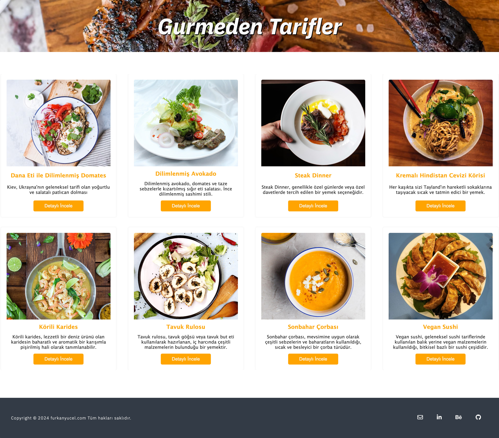

#Yemek Tarifi Uygulaması Projesi

### Bu proje, Emin Başbayan'ın eğitimini vermiş olduğu React Kursu'ndaki ilk github projesidir. 

### Proje konusu; yemek tarifleri üzerine bir çalışmadır.

### Projeyi gezdiğinizde bir çok yemek çeşidini, yemek hakkında kısa açıklamasını, yemeğin yapımı için gerekli olan malzemeleri ve yemeğin nasıl hazırlanacağı ile ilgili bilgileri bulacaksınız.

## Kullanılan Teknolojiler

- HTML
- Module CSS
- React.js

## Kurulum ve Başlatma

1. Repoyu bilgisayarına klonlamak için VSCode programını aç
2. View bölümünden Command Palette yı seç ve "Git:Clone" seç ya da yazıp enter yap
3. Çıkan bölümde "Clone from GitHub" seç ve enter yap
4. Repository name alanına bu linki yapıştır ve enter yap: https://github.com/furkanyucel/Yemek-Tarifi-Uygulamas-Projesi.git
5. Çıkan bölümde reponun bilgisayarında hangi alana indirilmesini istiyorsan orayı seç
6. VSCode Terminal sekmesini aç ve açılan alana npm install yazarak node_modules paketinin kurulduğundan emin ol.
7. Kurulum tamamlandığında Terminal alanına npm run dev yazarak projeni çalıştır.
8. Terminal de Local:   http://localhost:5173/ benzeri bir link çıkacak. Buna tıklayarak projeyi chrome vb. browserda inceleyebileceksin.
9. Repo'yu indirdiğim teşekkürler. Lütfen proje ile ilgili yorumlarını furkanyucelux@gmail.com mailimden bana bildir.

## Ekran Görüntüleri
